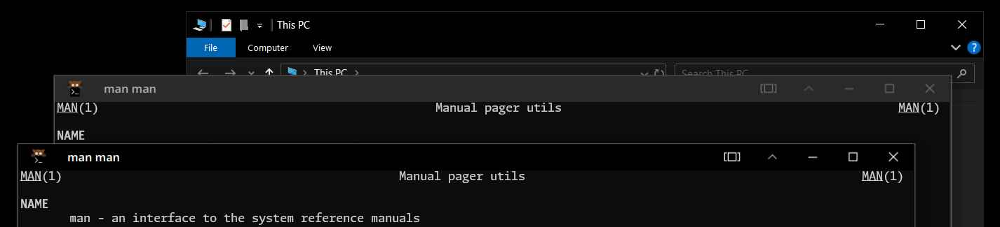

# Windows10 KDE Plasma decoration

This is a very Windows 10 like decoration for KDE Plasma.\
It's just a recreate, not including personalized changes(unless icon doesn't exist).

I really want to see more UI with right angles, but in these years people have grown to dislike it.\
Adobe, Windows 11, Microsoft, webpages, VSCode, many hardwares, even the KDE Plasma 6. All over the computer.

People may just think it's a fad. But I have what I love. High contrast, 0x000000 base color, that means technology.\
Alas... That may have been overstated. But what the world needs is artful UI.

## Preview



Windows 10 VM -> inactive -> active

## Install

In the repository root, and run `./install.sh`. It will install this decoration for that user self.\
I recommend not putting buttons on the left of the title. That way it'll be too close to the title.

When it is stabled, I'll upload them to KDE Store.

## Thanks for

The [vinceliuice/Qogir-theme](https://github.com/vinceliuice/Qogir-theme) and [vinceliuice/Qogir-kde](https://github.com/vinceliuice/Qogir-kde) provided a basic framework for my reference.\
However, the **Willow dark** decoration in [doncsugar/willow-theme](https://github.com/doncsugar/willow-theme) is more like this project, but it use rounded corners on the outside and have some details are different.

Well...\
I still need to say... At now, no one will use Qt to create a decoration, except Breeze made by KDE self.\
Sorry, but I'm really not familiar with Qt.

## Animation

The animation may show what's behind it when it fades. But, if you want, 150ms is the value used by Windows10 buttons:

```ini
Animation=150
```

Add it to `[General]` section of `aurorae/themes/Windows10-dark/Windows10-darkrc`

## License

All content published under **GNU General Public License v3 or later**.

Copyright (C) 2025 酸柠檬猹/SourLemonJuice
